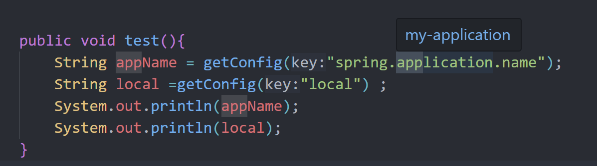
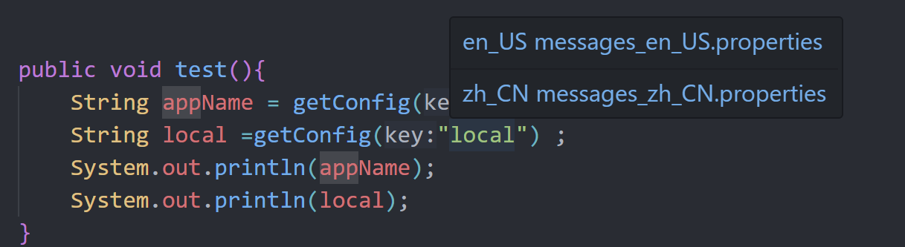
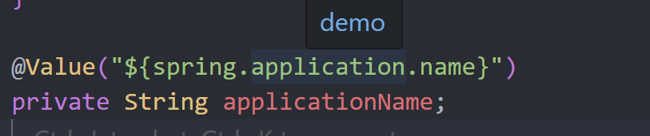

# Java Properties Navigator

[English](README.md) | 中文

[](https://marketplace.visualstudio.com/items?itemName=pengge.java-properties-navigator)
[](https://marketplace.visualstudio.com/items?itemName=pengge.java-properties-navigator)
[](https://marketplace.visualstudio.com/items?itemName=pengge.java-properties-navigator)

**Java代码与配置文件之间的智能导航**

Java Properties Navigator 是一个强大的 VS Code 扩展，提供 Java 源代码与配置文件之间的无缝导航。从 Java 代码中的属性键瞬间跳转到 `.properties`、`.yml` 和 `.yaml` 文件中的定义。

## ✨ 功能特性

### 🎯 智能属性检测
- **自动识别**：智能检测 Java 字符串中的属性键
- **上下文感知**：支持变量、方法参数和注解
- **多格式支持**：支持 `.properties`、`.yml` 和 `.yaml` 文件

### 🚀 即时导航
- **一键跳转**：右键点击任意属性键即可跳转到定义
- **快捷键支持**：使用 `Alt+Shift+P` (Windows/Linux) 或 `Cmd+Shift+P` (macOS) 快速导航
- **多位置支持**：当属性存在于不同文件中时可选择跳转位置

### 💡 增强开发体验
- **悬停信息**：无需离开 Java 代码即可查看属性值
- **状态栏集成**：快速访问重建索引和扩展状态
- **实时更新**：配置文件更改时自动刷新

### 🔧 高级配置
- **灵活扫描**：自定义扫描目录和文件类型
- **智能排除**：排除构建目录、node_modules 和其他无关路径
- **环境支持**：处理多环境配置（开发、生产、测试）

## 📦 安装

1. 打开 VS Code
2. 转到扩展 (`Ctrl+Shift+X` 或 `Cmd+Shift+X`)
3. 搜索 "Java Properties Navigator"
4. 点击 **安装**

或者，从 [Visual Studio Code 应用商店](https://marketplace.visualstudio.com/items?itemName=pengge.java-properties-navigator) 安装。

## 🚀 快速开始

1. **打开 Java 项目**（包含配置文件）
2. **将光标放置**在 Java 代码中的属性键字符串上
3. **右键点击**并选择"跳转到属性"或使用 `Alt+Shift+P`
4. **即时导航**到属性定义

### 使用示例

```java
// Java 代码

 @Value("${spring.application.name}")
 private String applicationName;

 public void test(){
        String appName = getConfig("spring.application.name");
        String local =getConfig("local") ;
        System.out.println(appName);
        System.out.println(local);
 }
 
```







扩展将帮助您从 `"server.port"` 和 `"welcome.message"` 导航到配置文件中的定义。

## ⚙️ 配置

### 扩展设置

| 设置 | 描述 | 默认值 |
|------|------|--------|
| `java-properties-navigator.scanDirectories` | 扫描属性文件的目录 | `["src/main/resources", "**/src/main/resources"]` |
| `java-properties-navigator.excludePatterns` | 扫描时排除的模式 | `["**/target/**", "**/build/**", "**/node_modules/**"]` |
| `java-properties-navigator.fileExtensions` | 包含的文件扩展名 | `[".properties", ".yml", ".yaml"]` |
| `java-properties-navigator.enableDiagnostics` | 启用未定义属性的诊断 | `true` |
| `java-properties-navigator.showStatusBar` | 显示状态栏项 | `true` |
| `java-properties-navigator.autoRebuildOnConfigChange` | 配置更改时自动重建索引 | `true` |

### 高级排除模式

配置排除模式以优化扫描性能：

```json
{
  "java-properties-navigator.excludePatterns": [
    "**/target/**",
    "**/build/**", 
    "**/node_modules/**",
    "**/.git/**",
    "**/temp/**",
    "*.backup",
    "test-resources/**"
  ]
}
```

### 多模块项目

对于复杂的多模块项目：

```json
{
  "java-properties-navigator.scanDirectories": [
    "*/src/main/resources",
    "*/*/src/main/resources", 
    "config/**",
    "shared/resources/**"
  ]
}
```

## 🎮 命令

| 命令 | 描述 | 快捷键 |
|------|------|--------|
| `跳转到属性` | 导航到属性定义 | `Alt+Shift+P` (Win/Linux)<br>`Cmd+Shift+P` (macOS) |
| `重建属性索引` | 手动重建属性索引 | - |
| `查找属性使用` | 查找属性的使用位置（即将推出） | - |

## 🔍 工作原理

1. **索引**：扫描项目中的配置文件并构建索引
2. **检测**：分析 Java 字符串以识别潜在的属性键  
3. **导航**：提供到属性定义的即时导航
4. **更新**：监控文件更改并自动更新索引

## 🛠️ 支持的文件类型

- **属性文件**：`.properties`
- **YAML 文件**：`.yml`、`.yaml`
- **Java 文件**：`.java`（用于属性键检测）

## 📋 系统要求

- **VS Code**：版本 1.60.0 或更高
- **Java 项目**：在标准位置包含配置文件

## 🐛 故障排除

### 常见问题

**问：找不到属性？**
- 确保配置文件在扫描目录中
- 检查 `scanDirectories` 设置
- 使用状态栏按钮重建索引

**问：大型项目性能问题？**
- 为无关目录添加更多排除模式
- 仅限制扫描目录到必要路径

**问：导航不工作？**
- 验证属性键是有效的字符串字面量
- 检查属性是否存在于配置文件中
- 尝试重建索引

### 重置扩展

如果遇到持续问题：
1. 打开命令面板 (`Ctrl+Shift+P`)
2. 运行"重建属性索引"
3. 如需要可重启 VS Code

## 🤝 贡献

我们欢迎贡献！请查看我们的 [贡献指南](https://github.com/java-tools/java-properties-navigator/blob/main/CONTRIBUTING.md) 了解详情。

### 开发设置

1. 克隆仓库
2. 运行 `npm install`
3. 在 VS Code 中打开
4. 按 `F5` 开始调试

## 📄 许可证

本项目基于 MIT 许可证 - 查看 [LICENSE](LICENSE) 文件了解详情。

## 🙏 致谢

- 感谢 VS Code 团队提供出色的扩展 API
- 受到对更好 Java 开发工具需求的启发
- 为 Java 社区用 ❤️ 构建

---

**享受 Java 代码与配置文件之间的无缝导航！** 🚀 